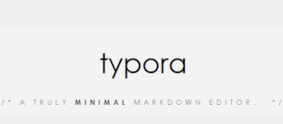

# 📝Markdown

> 마크다운은 plain text 기반의 마크업 언어의 일종이다.


## 제목/ 소제목 (Heading)

>Heading은 문서의 `제목`이나 `소제목`으로 사용 (글씨크기 키우는 용도❌)
>
>h1 ~ h6 까지 표현 가능

# h1 : `# h1`

## h2 : `## h2`

### h3 : `### h3`

#### h4 : `#### h4`

##### h5 : `##### h5`

###### h6 : `###### h6`


## 목록 (list)

> 목록 활용시 단계를 `tab`과 `shift + tab`으로 조절


### 순서가 없는 리스트 (ul)

> `-`(hypen), `*`(asterisk)

- 사과
- 바나나
  - 미니 바나나
  - Dole 바나나
- 딸기
- 복숭아
  - 백도 복숭아
  - 천도 복숭아


### 순서가 있는 리스트 (ol)

> `1.` + `space bar`

아침에 일어나서 KDT 교육 듣기

1. 세수하고 양치
2. 산책
3. Syllaverse 홈페이지 접속한다.
   1. 로그인
   2. 대시보드 확인
4. 유튜브 라이브에 접속한다.
   1. 인사를 남긴다.


## 코드 블록(Fenced Code block)

- `(backtick) 기호 3개를 활용하여 작성한다.
- 특정 언어를 명시하면 Syntax highlighting 기능이 적용된다.

```python
print('hello')

if True:
    print('t')
else:
    print('f')
# 주석
```

```html
print('hello')
# 주석?
<h1>
    제목
</h1>
<!-- 주석 -->
```


### Inline Code block

> backtick 기호 1개를 인라인에 활용하여 작성

- `print` 함수는 파이썬에서 출력하는 함수이다.

- `코드`나 `함수` 이름에 사용한다.


## 링크

>`[문자열](url)`
>
>`ctrl`  + `click`

- [실라버스 링크](https://www.syllarverse.com)


## 이미지

> ``  - 상대참조




> 이미지 가져다놓기 - 절대참조


## 인용문

> `>`

> Life is short, you need python.

## 표

> 본문 > 표 > 표 삽입 (`ctrl` + `t`)


| 이름   | Github 주소             |
| ------ | ----------------------- |
| 이상욱 | https://github.com/wxxk |
|        |                         |
|        |                         |

## 텍스트

- **굵게(볼드체)** : `**`

- *기울림(이탤릭체)* : `*`

- ~~취소선~~ : `~~`


## 수평선

`---`

---


## 기타 정리

- 띄어쓰기 사용 하는 것

  - 제목 (`#`)

  - 목록 (`- `, `1. `)


- 띄어쓰기 없는 것
  - `inline`, `code block`, *기울임*, **굵게**


- 이모지 : `window` + `.`


- 스크린샷 : `window` + `shift` + `s`
