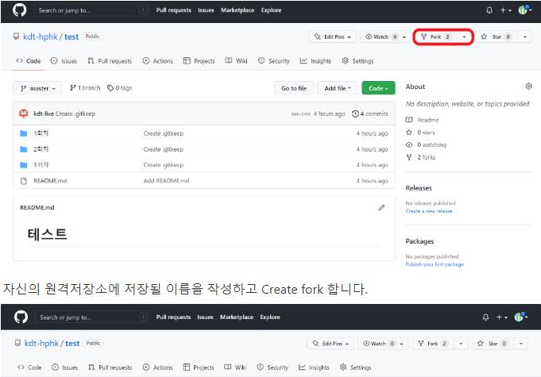
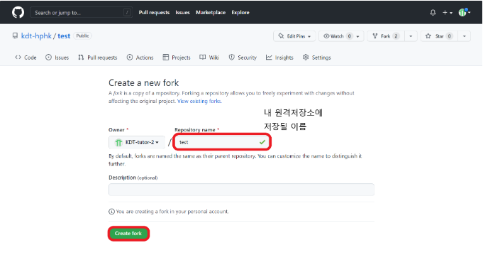
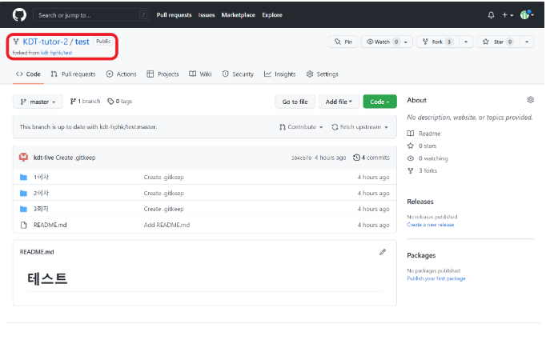
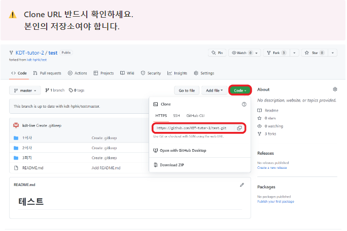
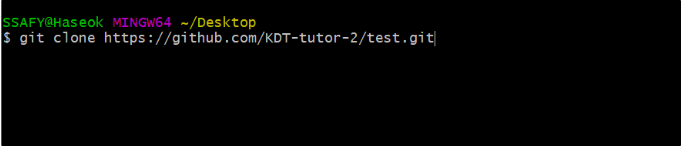
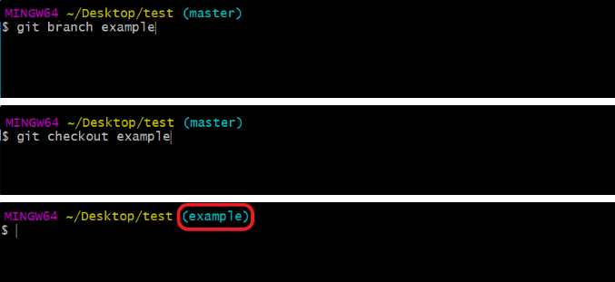
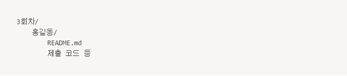
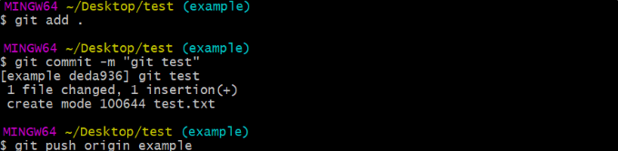
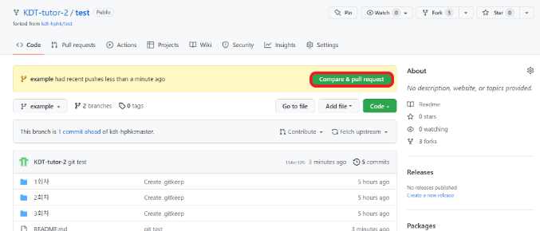
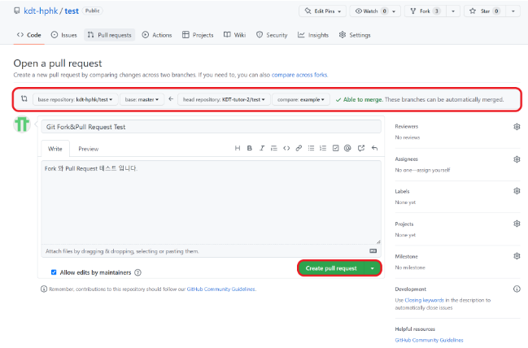

## Fork

#### (GitHub) Fork

1. Fork할 저장소에서 우측 상단의 Fork 버튼 클릭

2. 자신의 원격저장소에 저장될 이름을 작성하고 Create fork

3. 자신의 원격저장소에서 확인

#### (Local) Clone & Branch 생성

1. Fork 받아온 저장소를 로컬로 clone

2. branch를 생성하고 이동

#### (Local) 과제 내용 폴더에 추가하고 커밋

1. 해당하는 회차 내부에 교육생이름으로 폴더를 생성

2. 교육생 폴더에 README.md와 제출 코드 등을 추가

3. 작업 완료 후 변경 사항을 add, commit, push

#### (GitHub) Pull Request

1. Github에서 compare & pull request를 생성

2. pull request 내용을 작성한 후 create pull request

- head repository와 base repository를 확인
- head -> base 방향으로 merge

