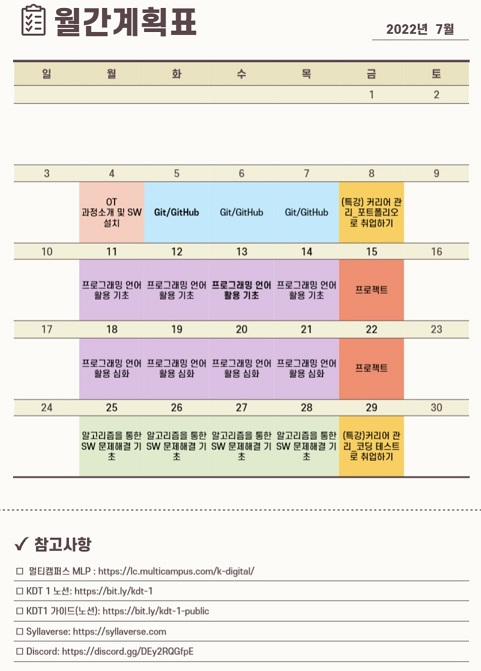

# 🏫K-Digital Training

## 🛠실무 맞춤형 풀스택 개발

### 📊커리큘럼

---

### ✒문제풀이

| [코드업](codeup) | [실습](training) | [SWEA](SWEA) |
| ---------------- | ---------------- | ------------ |

---

### 📚배운 것

- **7월**

| 일요일 | 월요일                    | 화요일                    | 수요일                    | 목요일 | 금요일 | 토요일 |
| ------ | ------------------------- | ------------------------- | ------------------------- | ------ | ------ | ------ |
|        |                           |                           |                           |        | (1)    | (2)    |
| (3)    | [4일](./class/220704/README.md) | [5일](./class/220705/README.md) | [6일](./class/220706/README.md) | [7일](./class/220707/README.md) | (8)    | (9)    |
| (10)   | [11일](./class/220711/README.md) | [12일](./class/220712/README.md) | [13일](./class/220713/README.md) | [14일](./class/220714/README.md) | [15일](./class/220715/README.md) | (16)   |
| (17)   | [18일](./class/220718/README.md) | [19일](./class/220719/README.md) | [20일](./class/220720/README.md) | [21일](./class/220721/README.md) | (22)   | (23)   |
| (24)   | (25)                      | (26)                      | (27)                      | (28)   | (29)   | (30)   |
| (31)   |                           |                           |                           |        |        |        |

---

### [메모장](memo.md)
