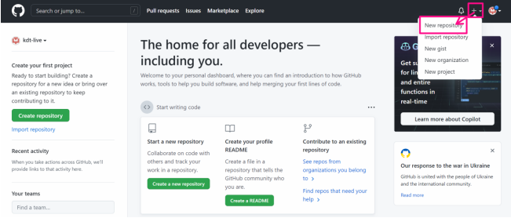
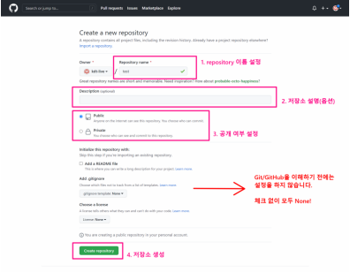
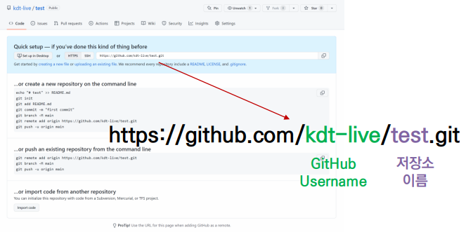

## ☁원격 저장소 만들기

### 1. New Repositioty



### 2. 저장소 설정하기



### 3. 확인하기




---


## 📲로컬저장소의 버전을 원격저장소로 보내주기

### 1. 원격저장소 주소 확인

### 


### 2. 원격저장소 활용 명령어 - push

### 


### 3. 원격저장소 활용 명령어 - pull


---


## 🕹원격저장소 설정 기본 명령어

```bash
$ git clone <url> : 원격 저장소 복제

$ git remote -v : 원격저장소 정보 확인

$ git remote add <원격저장소> <url> : 원격저장소 추가 (일반적으로 origin)

$ git remote rem <원격저장소> : 원격저장소 삭제

$ git push  <원격저장소> <브랜치> : 원격저장소에 push

$ git pull <원격저장소> <브랜치> : 원격저장소로부터 pull
```

