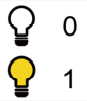
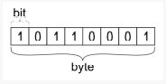

### 아스키(ASCII) 코드

> BOJ_10809 알파벳 찾기

- 컴퓨터는 숫자만 이해할 수 있다.

  | 비트(bit)                               | 바이트(byte)                                    |
  | --------------------------------------- | ----------------------------------------------- |
  | 0과 1 두가지 정보만 표현                | 데이터를 저장하는 기본 단위 <br>1 byte == 8bits |
  |  |          |

- 문자가 저장되는 방법 : ASCII(미국 정보교환 표준부호)

- 알파벳을 표현하는 대표 인코딩 방식
- 각 문자를 표현하는데 1byte(8bits) 사용
  - 1bit : 통신 에러 검출용
  - 7bit : 문자 정보 저장 (총 128개)
- `ord(문자)` : 문자 -> 아스키코드로 변환하는 내장함수

```python
print(ord("A")) # 65
print(ord("a")) # 97
```

- `chr(아스키코드)` : 아스키코드 -> 문자로 변환하는 내장함수

```python
print(chr(65)) # A
print(chr(97)) # a
```

