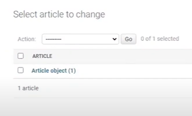
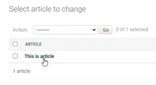
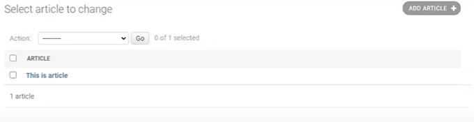
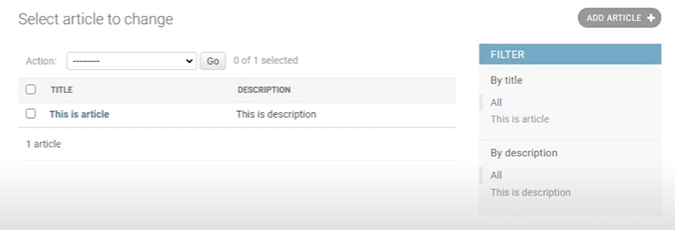
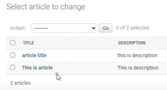

### Django Intro & Installation

```bash
$ pip install Django

$ pip install djangorestframework

$ django-admin startproject pjt

$ cd pjt

$ python manage.py runserver

$ python manage.py migrate

$ python manage.py startapp api

$ python manage.py createsuperuser
```


### View functions & URLS

```python
# api/views.py

from django.shortcuts import render, HttpResponse


def Index(request):
    return HttpResponse("It is working")


# pjt/urls.py
from django.contrib import admin
from django.urls import path, include
from api.views import Index

urlpatterns = [
    path('admin/', admin.site.urls),
	path('', include('api.urls')),
]
```

```python
# api앱에 urls.py 추가
# api/urls.py

from django.urls import path
from .views import Index

urlpatterns = [
    path('', Index),
]

```


### Django Models

```python
# pjt/settings.py
INSTALLED_APPS = [
    ...
	'api',
]


# api/models.py

from django.db import models

class Article(models.Model):
    title = models.CharField(max_length=100)
    description = models.TextField()
```

```bash
$ python manage.py makemigrations

$ python manage.py migrate
```

```python
# api/admin.py
from django.contrib import admin
from .models import Article

admin.site.register(Article)	# admin 페이지에서 글 작성 가능


# api/models.py

from django.db import models

class Article(models.Model):
    title = models.CharField(max_length=100)
    description = models.TextField()
    
    def __str__(self):
        return self.title
```

|  |  |
| ------------------------------------------------------------ | ------------------------------------------------------------ |


```python
# api/admin.py

...
# admin.site.register(Article)

@admin.register(Article)
class ArticleModel(admin.ModelAdmin):
    list_filter = ('title', 'description')
    list_display = ('title', 'description')
```

|                                        |
| ------------------------------------------------------------ |
|                                                              |
|  |


###  Serialization

```python
# pjt/settings.py
INSTALLED_APPS = [
    ...
	'api',
    'rest_framework'	# 등록
]


# api앱에 serializers.py 추가

# api/serializers.py
from rest_framework import serializers
from .models import Article

class ArticleSerializer(serializers.Serializer):
    title = models.CharField(max_length=100)
    description = models.CharField(max_length=400)
    
    def create(self, validated_data):
        return Article.objects.create(validated_data)
    
    def update(self, instance, validated_data):
        instance.title = validated_data.get('title', instance.title)
        instance.description = validated_data.get('description', instance.description)
```

```bash
$ cd pjt

$ python manage.py shell
```

```shell
$ from api.models import Article

$ from api.serializers import ArticlesSerializer

$ from rest_framework.renderers import JSONRenderer

$ from rest_framework.parsers import JSONParser

$ a = Article(title = "article title", description = "this is description")

$ a.save
```

|  |
| :--------------------: |

```shell
serializer = ArticleSerializer(a)

serializer.data
('title': 'article title', 'description': 'this is description')

json = JSONRenderer().render(serializer.data)

json
b'("title": "article title", "description": "this is description")'

import io

stram = io.BytesIO(json)

data = JSONParser().parse(stream)

serializer = ArticleSerializer(data=data)

serializer.is_valid()
True

serializer.validated_data
OrderedDict([('title', 'article title'), ('description', 'this is description')])
```


### Model Serializer

 ```python
 # api/serializers.py
 
 # 기존
 class ArticleSerializer(serializers.Serializer):
     '''title = models.CharField(max_length=100)
     description = models.CharField(max_length=400)
     
     def create(self, validated_data):
         return Article.objects.create(validated_data)
     
     def update(self, instance, validated_data):
         instance.title = validated_data.get('title', instance.title)
         instance.description = validated_data.get('description', instance.description)'''
     
     
 # 변경
 class ArticleSerializer(serializers.ModelSerializer):
     class Meta:
         model = Article
         fields = ['id', 'title', 'description']        
 ```

```bash
$ python manage.py shell
```

```shell
from api.serializers import ArticleSerializer

serializer = ArticleSerializer()

print(repr(serializer))
ArticleSerializer():
	id = IntergerField(label='ID', read_onl=True)
	title = CharField(max_length=100)
	description = CharField(style={'base_template': 'textarea.html'})
```


### Function Based API View

```python
# api/views.py

from django.shortcuts import render, HttpResponse
from .models import Article	# 추가
from .serializers import ArticleSerializer	# 추가
from django.http import JsonResonse	# 추가
from rest_framework.parsers impoort JSONParser	# 추가
from django.views.decorators.csrf import csrf_exempt	# 추가

'''삭제
def Index(request):
    return HttpResponse("It is working")'''

@csrf_exempt
def article_list(request):

    # get all articles
    if requset.method == 'GET':
        articles = Article.objects.all()
        serializer = Articleserializer(articles, many=True)
        return JsonResponse(serializer.data, safe=False)
    
    elif request.method == 'POST':
        data = JSONParser().parse(request)
        serializer = Articleserializer(data=data)
        if serializer.is_valid():
            serializer.save()
            return JsonResponse(serializer.data, status=201)
        JsonResponse(serializer.errors, status=400)
```

```python
# api/urls.py

from django.urls import path
from .views import article_list	# 수정

urlpatterns = [
    path('articles/', article_list),	# 수정
]
```

```python
# api/views.py

@csrf_exempt
def article_details(request, pk):
    try:
        article = Article.objects.get(pk=pk)
    
    except Article.DoseNotExist:
        return HttpResponse(status=404)
    
    if request.method == 'GET':
        serializer =ArticleSerializer(article)
        return JsonResponse(serializer.data)
    
    elif request.method == 'PUT'
        data = JSONParser().parse(request)
        serializer = Articleserializer(article, data=data)
        if serializer.is_valid():
            serializer.save()
            return JsonResponse(serializer.data)
        JsonResponse(serializer.errors)
        
    elif request.method == 'DELETE':
        article.delete()
        return HttpResponse(status=204)
```

```python
# api/urls.py

from django.urls import path
from .views import article_list, article_details

urlpatterns = [
    path('articles/', article_list),
    path('articles<int:pk>/', article_details),
]
```


### API View Decorator

```python
# api/views.py

from django.shortcuts import render, HttpResponse
from .models import Article
from .serializers import ArticleSerializer
from django.http import JsonResonse
from rest_framework.parsers impoort JSONParser
'''from django.views.decorators.csrf import csrf_exempt'''	# 삭제
from rest_framework.decorator import api_view	# 추가
from rest_framework.response import Response	# 추가
from rest_framework import status	#추가

'''@csrf_exempt'''	# 삭제
@api_view(['GET', 'POST'])
def article_list(request):

    # get all articles
    if requset.method == 'GET':
        articles = Article.objects.all()
        serializer = Articleserializer(articles, many=True)
        # return JsonResponse(serializer.data, safe=False)
        return Response(serializer.data)
    
    elif request.method == 'POST':
        # data = JSONParser().parse(request)
        serializer = Articleserializer(data=request.data)
        if serializer.is_valid():
            serializer.save()
            return Response(serializer.data, status=status.HTTTP_201_CREATED)
        JsonResponse(serializer.errors, status=status.HTTP_400_BAD_REQUEST)
        
        
        
# @csrf_exempt	삭제
@api_view(['GET', 'PUT', 'DELETE'])
def article_details(request, pk):
    try:
        article = Article.objects.get(pk=pk)
    
    except Article.DoseNotExist:
        return Response(status=status.HTTP_404_NOT_FOUND)
    
    if request.method == 'GET':
        serializer =ArticleSerializer(article)
        return Response(serializer.data)
    
    elif request.method == 'PUT'
        # data = JSONParser().parse(request)
        serializer = Articleserializer(article, data=request.data)
        if serializer.is_valid():
            serializer.save()
            return Response(serializer.data)
        return Response(serializer.errors, status=status.HTTP_400_BAD_REQUEST)
        
    elif request.method == 'DELETE':
        article.delete()
        return Response(status=status.HTTP_204_NO_CONTENT)
```


### Class Based API View

```python
# api / views.py
...
from rest_framework.decorators import APIView


class ArticleList(APIView):
    
	def get(self, request):
        articles = Article.objects.all()
        serializer = Articleserializer(articles, many=True)
        return Response(serializer.data)
    
    def post(self, request):
        serializer = Articleserializer(data=request.data)
        if serializer.is_valid():
            serializer.save()
            return Response(serializer.data, status=status.HTTTP_201_CREATED)
        return Response(serializer.errors, status=status.HTTP_400_BAD_REQUEST)
    

    
class ArticleDetails(APIView):
    
    def get_object(self, id):
        try:
        	return Article.objects.get(id=id)
    
    	except Article.DoseNotExist:
        	return Response(status=status.HTTP_404_NOT_FOUND)
        
   def get(self, request, id):
        article = self.get.object(id)
        serializer = ArticleSerializer(articles)
        return Response(serializer.data)
    
    
    def put(self, request, id):
        article = self.get.object(id)
        serializer = ArticleSerializer(article, data=request.data)
        if serializer.is_valid():
            serializer.save()
            return Response(serializer.data)
        return Response(serializer.errors, status=status.HTTP_400_BAD_REQUEST)
        
    def delete(self, request, id):
        article = self.get.object(id)
        article.delete()
        return Response(status=status.HTTP_204_NO_CONTENT)
```

```python
# api / urls.py
from django.urls import path
from .views import ArticleList
# article_list, article_details

urlpatterns = [
    path('articles/', ArticleList.as_view()),
    path('articles/<intLid>', ArticleDetails.as_view())
    # path('articles/', article_list),
    # path('articles<int:pk>/', article_details),
]
```


### Mixins

```python
# api/views.py

from rest_framwork generics
from rest_framwork import mixins

class ArticlesList(generics.GenericAPIView, mixins.ListModelMixin
                  mixins.CreateModelMixin):
    quertset = Article.objects.all()
    serializer_class = ArticleSerializer
    
    def get(self, request):
        return self.list(request)
    
    def post(self, request):
        return self.create(request)
    
    
    
class ArticleDetails(generics.GenericAPIView, mixins.RetrieveModelMixin,
                    mixins.UpdateModelMixin, mixins.DestroyModelMixin):
    quertset = Article.objects.all()
    serializer_class = ArticleSerializer
    
    lookup_field = 'id'
    
    def get(self, request, id):
        return self.retrieve(request, id=id)
    
    def put(self, request, id):
        return self.update(request, id=id)
    
    def delete(self, request, id):
        return self.destroy(request, id=id)
```


### ViewSets and Routers

```python
# api/views.py

from rest_framework import viewsets
from django.shortcuts import get_object_or_404


class ArticleViewSet(viewsets.ViewSet):
    
    def list(self, request):
        articles = Article.objects.all()
        serializer = ArticleSerializer(articles, many=True)
        return Response(serializer.data)
    
    def create(self, request):
        serializer = ArticleSerializer(data=request.data)
        if serializer.is_valid():
            serializer.save()
            return Response(serializer.data, status=status.HTTP_201_CREATED)
        return Response(serializer.errors, status=status.HTTP_400_BAD_REQUEST)
        
    def retrieve(self, request, pk=None):
        queryset = Article.objects.all()
		article = get_object_or_404(queryset, pk=pk)
        serializer = ArticleSerializer(article)
        return Response(serializer.data)
    
    def update(self, request, pk=None):
        article = Article.objects.get(pk=pk)
        
        serializer = ArticleSerializer(article, data=request.data)
        if serializer.is_valid():
            serializer.save()
            return Response(serializer.data, status=status.HTTP_201_CREATED)
        return Response(serializer.errors, status=status.HTTP_400_BAD_REQUEST)
    
    def destroy(self, request, pk=None):
        article = Article.objects.get(pk=pk)
        article.delete()
        return Response(status=status.HTTP_204_NO_CONTENT)
```

```python
# api/urls.py

from django.urls import path, include
# from .views import ArticleList, ArticleDetails
from .views import ArticleViewSet
from rest_framework.routers import DefaultRouter

router = DefaultRouter()
router.register('articles', ArticleViewSet, basename='articles')


urlpatterns = [
    path('', include(router.urls)),
]
```


### Generic Viewset

```python
# api/views.py

class ArticleViewSet(viewsets.GenericViewSet, mixins.ListModelMixin,
                    mixins.CreateModelMixin, mixins.RetrieveModelMixin,
                    mixins.UpdateModelMixin, mixinsDestroyModelMixin):
    queryset = Article.objects.all()
    serializer_class = ArticleSerializer
```


### Model Viewset

```python
# api/views.py

from .models import Article
from .serializers import ArticleSerializer
from rest_framework import viewsets


class ArticleViewSet(viewsets.ModelViewSet):
    queryset = Article.objects.all()
    serializer_class = ArticleSerializer
```


### Authentication & Authorization

```python
# settings.py

INSTALLED_APPS =[
    ...
    'rest_framework.authtoken'
]

REST_FRAMEWORK ={
    'DEFAULT_PERMISSION_CLASSES': [
        'rest_framework.permissions.IsAuthenticated'
    ]
}
```

```bash
$ python manage.py migrate
```

```python
# pjt/urls.py

...
from rest_framework.authtoken.views import obtain_auth_token

urlpatterns = [
    ...
    path('auth/', obtain_auth_token)
]
```

```python
# api/views.py

from rest_framework import viewsets
from rest_framework.authentication import TokenAuthentication
from rest_framework.permissions import IsAuthenticated

class ArticleViewSet(viewsets.ModelViewSet):
    queryset = Article.objects.all()
    serializer_class = ArticleSerializer
    permission_classes = [IsAuthenticated]
    authentication_classes = (TokenAuthentication,)
```


### Registration

```python
# api/serializers.py
...
from django.contrib.auth.models import User


class ArticleSerializer(serializers.ModelSerializer):
    class Meta:
        model = Article
        fields = ['id', 'title', 'description']  

        
# 추가
class UserSerializer(serializers.ModelSerializer):
    class Meta:
        model = User
        fields = ['id', 'username', 'password']
```

```python
# api/views.py
from .model import Article
from .serializers import ArticleSerializer, UserSerializer
from rest_framework import viewsets
from rest_framework.authentication import TokenAuthentication
from rest_framework.permissions import IsAuthenticated
from django.contrib.auth.models import User


class ArticleViewSet(viewsets.ModelViewSet):
    queryset = Article.objects.all()
    serializer_class = ArticleSerializer
    permission_classes = [IsAuthenticated]
    authentication_classes = (TokenAuthentication,)


class UserViewSet(viewsets.ModelViewSet):
    queryset = user.objects.all()
    serializer_class = UserSerializer
```

```python
# api/urls.py

from django.urls import path, include
from .views import ArticleViewSet, UserViewSet
from rest_framework.routers import DefaultRouter


router = DefaultRouter()
router.register('articles', ArticleViewSet, basename='articles')
#추가
router.register('users', UserViewSet)

urlpatterns = [
    path('api', include(router.urls)),
]
```

```python
# api/serializers.py
...
from rest_framework.authtoken.views import Token


class UserSerializer(serializers.ModelSerializer):
    class Meta:
        model = User
        fields = ['id', 'username', 'password']
        
        # 추가
        extra_kwargs = {'password':{
            'write_only': True,
            'required': True
        }}
        
        
    def create(self, validated_data):
        user = User.objects.create_user(**validated_data)
        Token.objects.create(user=user)
        return user
```

